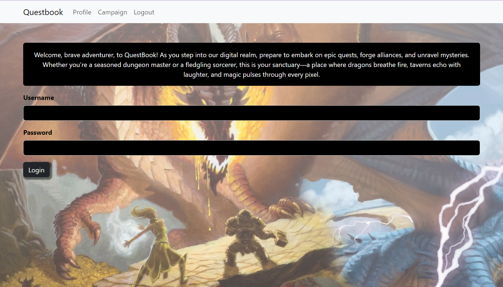

# Project 3 - MERN Stack Single-Page Application - Questbook

## Description

This website was created as a group project for the University of Richmond coding boot camp. The task was to work together to create a single-page web application fitting a user story that the group decided on, using the MERN stack and Apollo Server, among other requirements. To that end, we created an application for TTRPG players that allows you to create an account, save characters, and save campaigns. While working on this project, we learned a lot about cutting features to make a minimum viable product, time management while working in a very limited time scale, and the struggles of communicating effectively while coding in a group.

## Installation

N/A

## Usage

Visit the website at https://guarded-citadel-41709-e270466b60c1.herokuapp.com/.

When you first visit the site, you will see the login screen. To sign up for an account, click the signup link in the nav bar, and enter a unique username and email, and choose a password that contains an uppercase letter, a lowercase letter, a number, and a special character. Make sure to keep track of this username and password, as this site does not yet have a function to retrieve or reset lost login information.

After signing up or logging in, you will be taken to your profile, where you can see your current characters and a button to create a new character. When creating a new character, you will be asked to input their name, class/role, stats, and backstory. The stats you can input are based on the Dungeons & Dragons 5th Edition system, but we hope to offer support for other systems in the future. Your created characters will be saved to your account and can be edited or deleted at any time as long as you are logged in. Creating a campaign is very similar. The information required is very bare-bones at the moment, as there are many features not yet implemented on our site.

## Credits

The creators of this project are:

Na Ram Park: https://github.com/narampark

Madison Chazo: https://github.com/MadChazo

David Caldarone: https://github.com/caldardn

We used the [React Bootstrap](https://react-bootstrap.netlify.app/) front-end framework for this project, as well as MongoDB, Mongoose, Express, React, Node, and Apollo Server, among many other helpful accessory modules that can be found in our package.json files. We are very grateful to the contributors to those resources for their ease of use and comprehensive documentation.
